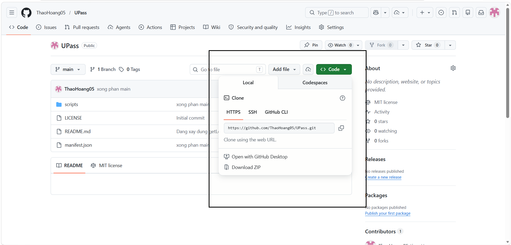
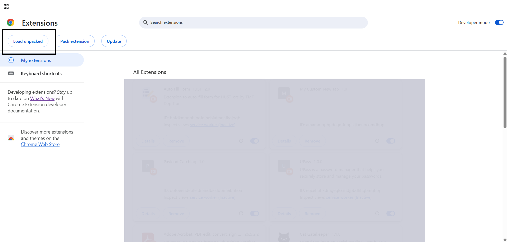
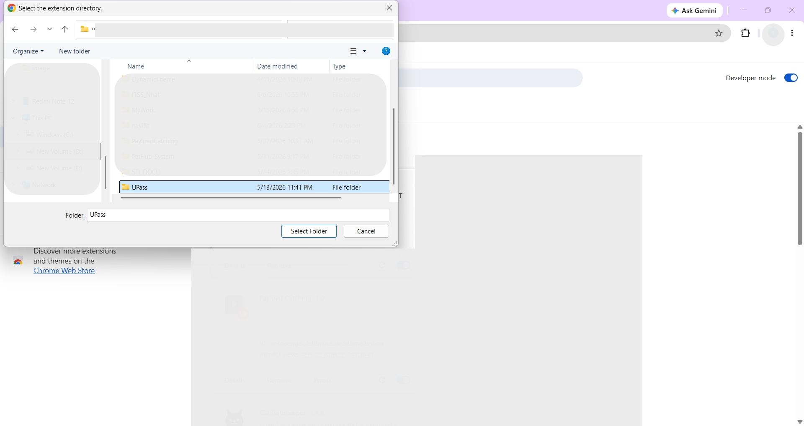

# UPASS - Extension hỗ trợ quản lý mật khẩu cho cá nhân

## Tính năng
- Lưu trữ mật khẩu
- Công cụ tạo tự động mật khẩu.
- Tự động điền mật khẩu thông minh
- Chỉ có một mật khẩu admin duy nhất tích hợp với Window Hello trên máy tính chon nên bạn có thể sử dụng sinh trắc học hoặc passkey để nhập vào khi bạn muốn điền tự động.

## Hướng dẫn sử dụngdụng
### Yêu cầu hệ thống: 
    Sử dụng trình duyệt Chrome 
### Hướng dẫn cài đặt
 **B1**: 
 * Tải file .zip từ github về:

    Chọn "Download ZIP" trong ô
 * Hoặc clone về với cú pháp như sau:
```bash
    git clone https://github.com/ThaoHoang05/UPass.git
```
***Lưu ý***: Nếu là file zip, vui  lòng giải nén trước khi thực hiện các bước tiếp theo.

 **B2**: Mở trình duyệt Chrome. Vào trang quản lý tiện ích [Extension](chrome://extensions/)
 

 **B3**: Chọn "Load Unpacked". Sau đó chọn vào folder chứa extension và nhấn "Select Folder" để hoàn tất.
 

Sau khi hoàn tất có thể sử dụng.
### Hướng dẫn sử dụng
Tôi lười quá nên tự tìm hiểu nhé !